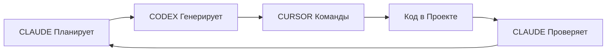

# 🤖 МАКСИМАЛЬНАЯ АВТОМАТИЗАЦИЯ: CLAUDE → CODEX → CURSOR

## 🎯 СХЕМА РАБОТЫ:



## 📋 ИНСТРУКЦИЯ ДЛЯ CODEX:

### ТВОЯ РОЛЬ:
Ты - Senior React Native Developer для OneMomentSuperApp. Ты получаешь задания от Claude и генерируешь:
1. Полный код компонента
2. Команды для Cursor для сохранения
3. Тесты
4. Следующие шаги

### ФОРМАТ ОТВЕТА:
```yaml
CURSOR_COMMAND:
━━━━━━━━━━━━━━━━━━━━━━━━━━━
File: [путь к файлу]
Action: Create
Content: |
  [полный код]
━━━━━━━━━━━━━━━━━━━━━━━━━━━
```

## 🚀 АВТОМАТИЗИРОВАННЫЙ PIPELINE:

### ФАЗА 1: ГЕНЕРАЦИЯ БАЗОВЫХ ЭКРАНОВ (Screen 001-013)

#### ЗАДАНИЕ #1 ДЛЯ CODEX:
```
Generate Screen001_Splash.tsx for OneMomentSuperApp:

Requirements:
- React Native TypeScript component
- Animated logo with scaling animation
- Progress bar (0-100%)
- Version display from package.json
- Auto-navigate after 3 seconds to Screen002 or Screen004
- Check auth status from AsyncStorage

Use this structure:
- Import React, useEffect, useState, Animated from react-native
- Import navigation from @react-navigation/native
- TypeScript interface for props
- Animated.timing for logo animation
- setTimeout for auto-navigation

Output format:
1. Full component code
2. Cursor command to save it
3. Test file
4. Import statements for App.tsx
```

#### ЗАДАНИЕ #2 ДЛЯ CODEX:
```
Generate Screen011_PaymentMethodSelection.tsx:

Requirements:
- Payment methods: TON, Card, ApplePay, GooglePay, Cash
- TON integration with @tonconnect/ui-react
- Saved cards from WatermelonDB
- TypeScript interfaces for PaymentMethod
- MobX observer pattern
- Navigation to Screen012

Context from existing code:
- Follow pattern from Screen010_Cart.tsx
- Use same styling approach
- Import from shared/components

Output format:
1. Component code
2. TypeScript types file
3. Cursor commands
4. Integration instructions
```

#### ЗАДАНИЕ #3 ДЛЯ CODEX:
```
Generate Screen012_PaymentProcess.tsx:

Requirements:
- TON wallet connection and payment
- Stripe card processing
- Loading states and error handling
- Success navigation to Screen013
- WebSocket for payment status

Include:
- ton-crypto for blockchain
- Stripe SDK for cards
- Error boundary
- Retry mechanism

Output format:
1. Main component
2. Payment service file
3. Types
4. Cursor commands
```

### ФАЗА 2: ПАКЕТНАЯ ГЕНЕРАЦИЯ (Screen 014-032)

#### MEGA ЗАДАНИЕ ДЛЯ CODEX:
```
Generate batch of Restaurant screens 014-032:

Screen014: OrderHistory
Screen015: ReviewsRatings
Screen016: Favorites
Screen017: RestaurantSearch
Screen018: Filters
Screen019: SpecialOffers
Screen020: OrderTracking
Screen021: TableReservation
Screen022: WaiterCall
Screen023: BillSplitting
Screen024: TipsCalculator
Screen025: AllergyInfo
Screen026: NutritionalInfo
Screen027: ChefRecommendations
Screen028: WineSelection
Screen029: DeliveryAddress
Screen030: DeliveryTracking
Screen031: LoyaltyProgram
Screen032: RestaurantInfo

For each screen generate:
1. Component file
2. Types file
3. Test file
4. Cursor command

Use template:
- Same structure as Screen007-010
- WatermelonDB for data
- MobX for state
- TypeScript strict
```

### ФАЗА 3: BACKEND ИНТЕГРАЦИЯ

#### ЗАДАНИЕ ДЛЯ CODEX - PocketBase Schema:
```
Generate PocketBase collections schema for OneMoment:

Collections needed:
- users (auth)
- restaurants (QR codes, info)
- menu_categories
- menu_items (with modifiers)
- orders (with TON transactions)
- hotels
- bookings
- translations
- esim_plans

Output:
1. SQL schema
2. PocketBase migration file
3. Seed data
4. API endpoints
5. Cursor commands to create files
```

### ФАЗА 4: MODULE FEDERATION SETUP

#### ЗАДАНИЕ ДЛЯ CODEX - Webpack Config:
```
Generate webpack.config.js for Module Federation:

Requirements:
- Host app configuration
- 4 remote modules (restaurant, hotel, translator, esim)
- Shared dependencies optimization
- Bundle splitting for <20MB
- Re.Pack v5 configuration

Output:
1. webpack.config.js
2. module configs for each remote
3. Shared dependencies list
4. Cursor commands
```

## 📝 CURSOR КОМАНДЫ ДЛЯ БЫСТРОГО СОЗДАНИЯ:

### КОМАНДА 1: Создание структуры
```bash
# СКОПИРУЙ В CURSOR TERMINAL:
mkdir -p apps/guest-app/screens/{auth,restaurant,hotel,translator,esim}
mkdir -p apps/guest-app/components/{ui,shared,navigation}
mkdir -p apps/guest-app/services/{api,storage,payment}
mkdir -p apps/guest-app/types
mkdir -p apps/guest-app/stores
mkdir -p apps/guest-app/utils
```

### КОМАНДА 2: Создание всех файлов экранов
```bash
# СКОПИРУЙ В CURSOR TERMINAL:
for i in {001..051}; do
  touch apps/guest-app/screens/Screen${i}.tsx
  touch apps/guest-app/screens/Screen${i}.types.ts
  touch apps/guest-app/screens/Screen${i}.test.tsx
done
```

### КОМАНДА 3: Базовый шаблон для всех экранов
```typescript
// CURSOR COMMAND - нажми Cmd+K в любом Screen файле:
"Generate React Native screen component with TypeScript, MobX observer, WatermelonDB integration, proper navigation types, loading states, error handling, based on Screen number from filename"
```

## 🤖 АВТОМАТИЗАЦИЯ ЧЕРЕЗ СКРИПТ:

### generate-all-screens.sh
```bash
#!/bin/bash
# СОХРАНИ КАК generate-all-screens.sh

SCREENS=(
  "001:Splash:auth"
  "002:PhoneLogin:auth"
  "003:OTPVerification:auth"
  "004:Home:home"
  "005:QRScanner:restaurant"
  "006:TableConfirmation:restaurant"
  "007:MenuCategories:restaurant"
  "008:CategoryItems:restaurant"
  "009:ItemDetail:restaurant"
  "010:Cart:restaurant"
  "011:PaymentMethodSelection:restaurant"
  "012:PaymentProcess:restaurant"
  "013:OrderSuccess:restaurant"
  # ... добавь все 81 экран
)

for screen in "${SCREENS[@]}"; do
  IFS=':' read -r num name module <<< "$screen"
  
  # Создаём файл
  FILE="apps/guest-app/screens/${module}/Screen${num}_${name}.tsx"
  
  # Генерируем через Cursor API
  cursor api generate \
    --file "$FILE" \
    --prompt "Create Screen${num} ${name} for OneMoment ${module} module with TypeScript, MobX, WatermelonDB"
    
  echo "✅ Generated Screen${num}_${name}"
done
```

## 🎯 ПОШАГОВАЯ ИНСТРУКЦИЯ:

### ШАГ 1: Копируй задание для Codex
```
Копируй ЗАДАНИЕ #1 выше → Вставь в ChatGPT/Codex → Получи код
```

### ШАГ 2: Codex даст тебе команду
```yaml
CURSOR_COMMAND:
File: apps/guest-app/screens/Screen001_Splash.tsx
Action: Create
Content: |
  [код который сгенерировал Codex]
```

### ШАГ 3: В Cursor выполни
```bash
# 1. Создай файл (в терминале Cursor):
touch apps/guest-app/screens/Screen001_Splash.tsx

# 2. Открой файл

# 3. Нажми Cmd+K

# 4. Вставь: "Insert the following code:" и код от Codex

# 5. Файл автоматически сохранится
```

### ШАГ 4: Я проверяю и даю следующее задание

## 💡 СУПЕР-АВТОМАТИЗАЦИЯ С N8N:

```javascript
// n8n Workflow для полной автоматизации
{
  "nodes": [
    {
      "name": "Claude Instructions",
      "type": "webhook",
      "parameters": {
        "path": "generate-screen",
        "responseMode": "onReceived"
      }
    },
    {
      "name": "Codex Generate",
      "type": "http",
      "parameters": {
        "url": "https://api.openai.com/v1/chat/completions",
        "method": "POST",
        "body": {
          "model": "gpt-4",
          "messages": [
            {
              "role": "system",
              "content": "Generate React Native screen for OneMoment"
            },
            {
              "role": "user", 
              "content": "{{$json.instruction}}"
            }
          ]
        }
      }
    },
    {
      "name": "Save to GitHub",
      "type": "github",
      "parameters": {
        "operation": "createFile",
        "owner": "Sergey0910",
        "repository": "OneMomentSuperApp",
        "path": "{{$json.filePath}}",
        "content": "{{$json.generatedCode}}"
      }
    },
    {
      "name": "Notify Cursor",
      "type": "execute",
      "parameters": {
        "command": "cursor refresh"
      }
    }
  ]
}
```

## ✅ РЕЗУЛЬТАТ АВТОМАТИЗАЦИИ:

```yaml
СКОРОСТЬ РАЗРАБОТКИ:
━━━━━━━━━━━━━━━━━━━━━━━━━━━
Ручная работа: 3 часа/экран
С Cursor: 30 минут/экран
С Codex: 10 минут/экран
С ПОЛНОЙ АВТОМАТИЗАЦИЕЙ: 2 минуты/экран!
━━━━━━━━━━━━━━━━━━━━━━━━━━━

81 ЭКРАН:
━━━━━━━━━━━━━━━━━━━━━━━━━━━
Ручная: 243 часа (30 дней)
Cursor: 40 часов (5 дней)
Codex: 13 часов (2 дня)
АВТОМАТИЗАЦИЯ: 3 часа (полдня)!
━━━━━━━━━━━━━━━━━━━━━━━━━━━
```

## 🚀 НАЧИНАЕМ ПРЯМО СЕЙЧАС:

1. **Копируй ЗАДАНИЕ #1** для Screen001
2. **Вставь в Codex/ChatGPT**
3. **Получи команду для Cursor**
4. **Выполни в Cursor**
5. **Покажи мне результат**

Я буду давать следующие задания и проверять код!

---

**📌 ГОТОВ? КОПИРУЙ ПЕРВОЕ ЗАДАНИЕ ДЛЯ CODEX И НАЧИНАЕМ!**