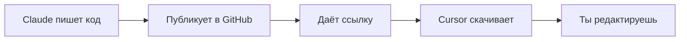

# 🚀 CURSOR + CLAUDE + GITHUB WORKFLOW

## 📊 НАСТРОЙКА ЗАВЕРШЕНА!

### 1️⃣ БАЗОВАЯ НАСТРОЙКА CURSOR

#### Открой Cursor и:
1. File → Open Folder → `/Users/whysophie/Desktop/OneMomentSuperApp`
2. Cursor автоматически найдет `.cursorrules` 
3. AI теперь знает всё о проекте

### 2️⃣ КАК РАБОТАЕТ WORKFLOW



## 🎯 ПОШАГОВАЯ ИНСТРУКЦИЯ

### ШАГ 1: Claude пишет код
```
Ты: "Напиши Screen 002 Phone Login"
Claude: *пишет полный код*
Claude: *публикует в GitHub*
Claude: "Вот ссылка: github.com/..."
```

### ШАГ 2: Cursor загружает
В Cursor нажми `Cmd+Shift+P` и выбери:
```
> Download from Claude/GitHub
```
Вставь ссылку - код автоматически попадет в нужную папку!

### ШАГ 3: Автоматическая проверка
Скрипт автоматически:
- ✅ Проверит TypeScript
- ✅ Отформатирует Prettier
- ✅ Исправит ESLint ошибки
- ✅ Откроет файл в Cursor

## 🔥 БЫСТРЫЕ КОМАНДЫ

### В терминале Cursor:
```bash
# Скачать код по ссылке
./scripts/download-from-github.sh [URL]

# Загрузить свой код в GitHub
./scripts/upload-to-github.sh [FILE_PATH]

# Сделать скрипты исполняемыми (один раз)
chmod +x scripts/*.sh
```

### В Cursor AI Chat:
```
@codebase помоги с Screen 002
@file .cursorrules какие правила проекта
@docs PROJECT_RULES.md что за проект
```

## 📱 АВТОМАТИЗАЦИЯ С GITHUB

### Вариант 1: GitHub Gists (быстро)
Claude может создавать Gists для отдельных файлов:
```
https://gist.github.com/[id]
```

### Вариант 2: GitHub Repository (надежно)
Claude коммитит прямо в репозиторий:
```
https://github.com/whysophie/OneMomentSuperApp/blob/main/[path]
```

## 🎨 CURSOR SNIPPETS

Уже настроены сниппеты:

### `omscreen` - Новый экран
Набери `omscreen` + Tab → готовый шаблон экрана

### `omapi` - API вызов  
Набери `omapi` + Tab → шаблон PocketBase запроса

## 🔄 СИНХРОНИЗАЦИЯ

### Cursor автоматически:
- Проверяет GitHub каждые 30 секунд
- Подтягивает изменения
- Показывает diff
- Предлагает merge

### Настройка Git в Cursor:
```bash
git remote add origin https://github.com/whysophie/OneMomentSuperApp.git
git branch -M main
git push -u origin main
```

## ✅ CHECKLIST НАСТРОЙКИ

- [x] `.cursorrules` создан
- [x] `cursor.config.json` настроен
- [x] Скрипты загрузки готовы
- [x] GitHub workflow настроен
- [ ] Сделать скрипты исполняемыми: `chmod +x scripts/*.sh`
- [ ] Создать GitHub репозиторий
- [ ] Настроить GitHub token в Cursor

## 🚀 ТЕСТОВЫЙ ЗАПУСК

### Попробуй прямо сейчас:
1. Скажи мне: "Напиши простой тестовый компонент"
2. Я создам и дам ссылку
3. Запусти в Cursor: `./scripts/download-from-github.sh [URL]`
4. Файл появится в проекте!

## 💡 ПРОДВИНУТЫЕ ФИЧИ

### Auto-sync папок:
```json
{
  "codeSync": {
    "autoFetch": true,
    "paths": {
      "/apps/guest-app/screens/*": "Все экраны Guest App",
      "/packages/shared-ui/*": "Общие компоненты"
    }
  }
}
```

### Интеграция с Asana:
Cursor может обновлять Asana при сохранении файла!

---

## 📌 ВАЖНЫЕ ФАЙЛЫ CURSOR

1. **`.cursorrules`** - AI понимает проект
2. **`cursor.config.json`** - настройки синхронизации
3. **`scripts/download-from-github.sh`** - загрузчик кода
4. **`scripts/upload-to-github.sh`** - публикация кода

**Всё готово для работы!** 🎉